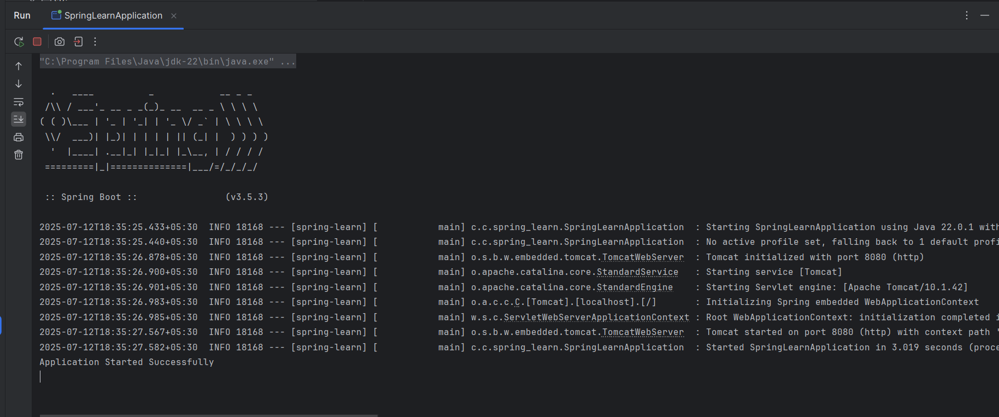

# Exercise 1 – Create Spring Web Project

This exercise demonstrates how to generate a Spring Boot web application using Spring Initializr.

## Summary

- Created a Maven-based Spring Boot project
- Included dependencies: Spring Web, Spring Security
- Verified the project structure and application startup

## Files

- 🔗 [pom.xml](./spring-learn/pom.xml)
- 🖼️ [Build Output Screenshot](./output.png)

## Output
### ▶️ Console Logs
- 
