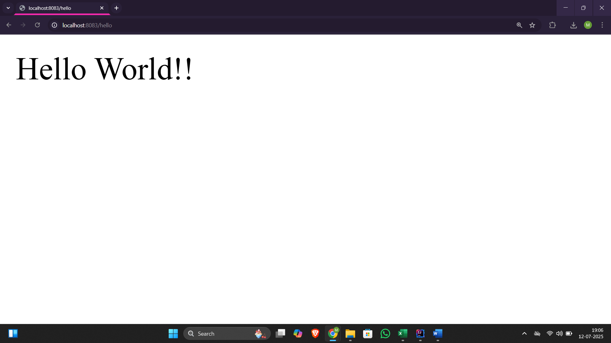
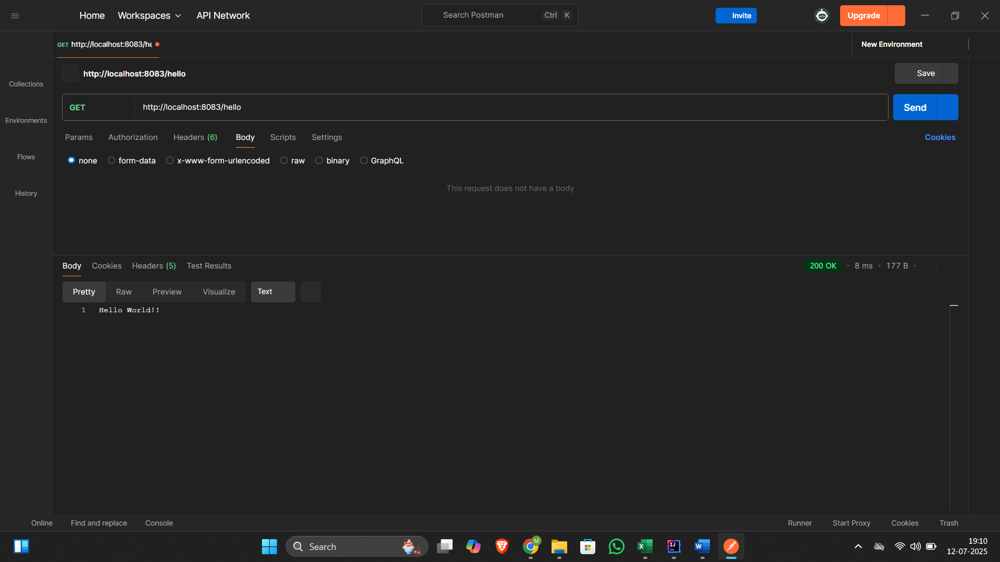
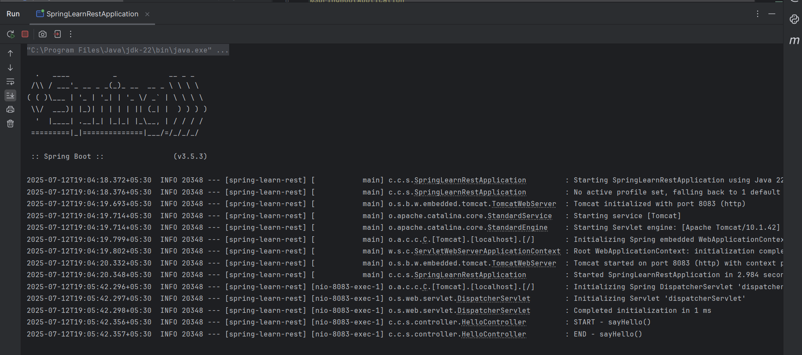

# Exercise 3 – Hello World REST Web Service

This exercise demonstrates a simple REST endpoint using Spring Boot.

## Summary

- Created `HelloController` with `/hello` endpoint
- Returned hardcoded response: `"Hello World!!"`
- Verified output in browser and Postman

## Files

- 🔗 [HelloController.java](./spring-learn-rest/src/main/java/com/congnizant_dn/spring_learn_rest/controller/HelloController.java)
- 🖼️ [Browser_Response_Output](./Browser_Response_Output.png)
- 🖼️ [Postman_Response_Output](./Postman_Response_Output.png)
- 🖼️ [Console Log Output](./Console_Log_Output.png)

## Output

### ▶️ Browser Response

### ▶️ Postman Response

### ▶️ Console Log Output

