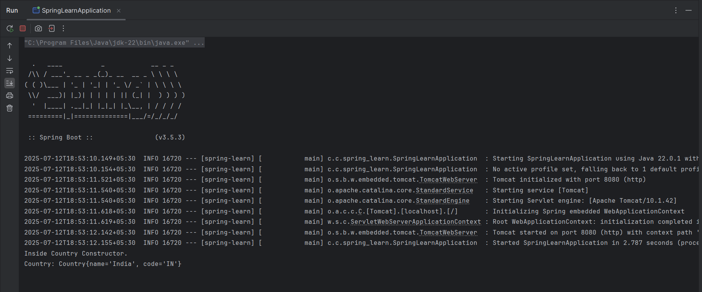

# Exercise 2 – Load Country from Spring XML

This exercise demonstrates loading a `Country` bean from an XML configuration using Spring Framework.

## Summary

- Defined `Country` bean in `country.xml`
- Loaded bean using `ClassPathXmlApplicationContext`
- Displayed bean values via `System.out.println`

## Files

- 🔗 [country.xml](./spring-learn/src/main/resources/country.xml)
- 🔗 [Country.java](./spring-learn/src/main/java/com/cognizant_dn/spring_learn/model/Country.java)
- 🔗 [SpringLearnApplication.java](./spring-learn/src/main/java/com/cognizant_dn/spring_learn/SpringLearnApplication.java)
- 🖼️ [Output Screenshot](./output.png)

## Output

### ▶️ Console Logs
- 
