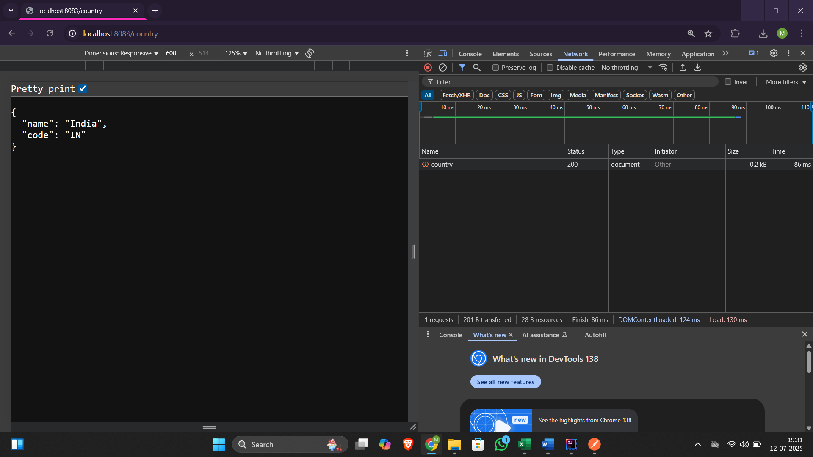
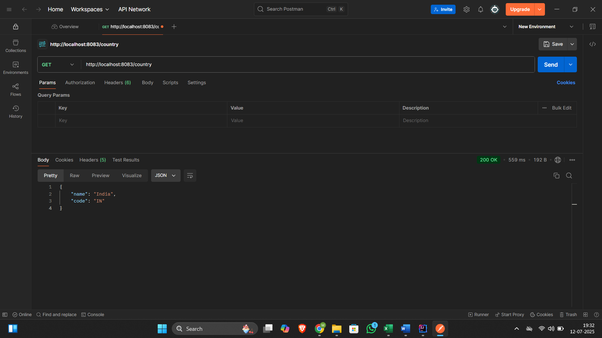
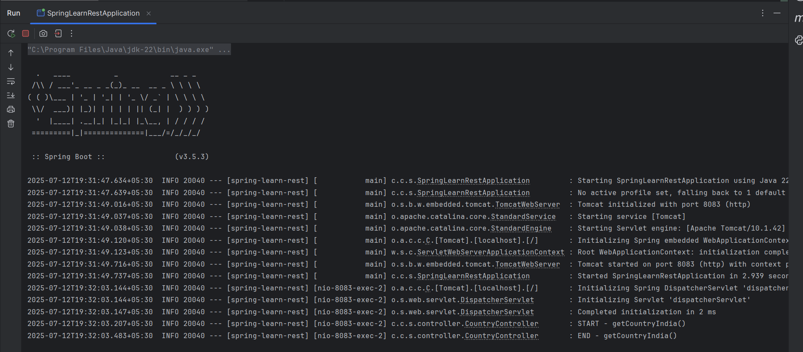

# Exercise 4 – Country Web Service

This exercise implements a REST endpoint that returns a single country object.

## Summary

- Loaded `Country` bean from `country.xml`
- Returned the bean from a REST controller using Jackson JSON conversion

## Files

- 🔗 [CountryController.java](./spring-learn-rest/src/main/java/com/congnizant_dn/spring_learn_rest/controller/CountryController.java)
- 🔗 [country.xml](./spring-learn-rest/src/main/resources/country.xml)
- 🖼️ [Browser_Response_Output](./Browser_Response_Output.png)
- 🖼️ [Postman_Response_Output](./Postman_Response_Output.png)
- 🖼️ [Console_Log_Output](./Console_Log_Output.png)

## Output
### ▶️ Browser Response

### ▶️ Postman Response

### ▶️ Console Logs

