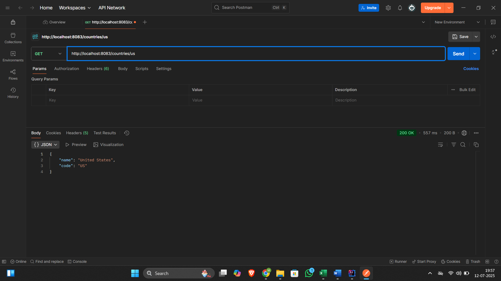
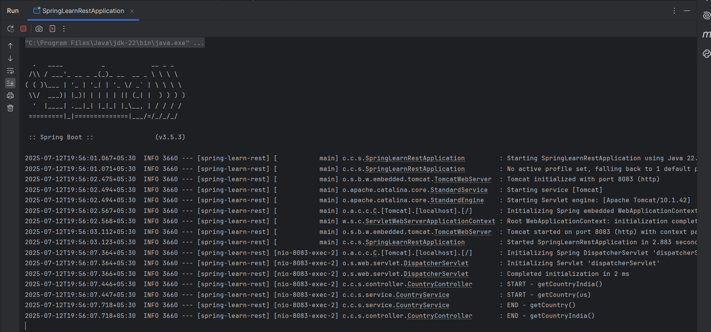

# Exercise 5 – Get Country by Code

This exercise extends the Country Web Service by allowing dynamic retrieval using a path variable.

## Summary

- Loaded a list of countries from `country.xml`
- Returned the country matching a given code (case-insensitive)
- Used `/countries/{code}` endpoint

## Files

- 🔗 [CountryService.java](./spring-learn-rest/src/main/java/com/congnizant_dn/spring_learn_rest/service/CountryService.java)
- 🔗 [CountryController.java](./spring-learn-rest/src/main/java/com/congnizant_dn/spring_learn_rest/controller/CountryController.java)
- 🔗 [country.xml](./spring-learn-rest/src/main/resources/country.xml)
- 🖼️ [Postman_Response_Output](./Postman_Response_Output.png)
- 🖼️ [Console_Log_Output](./Console_Log_Output.png)

## Output
### ▶️ Country API Response in Postman

### ▶️ Console Log Output

