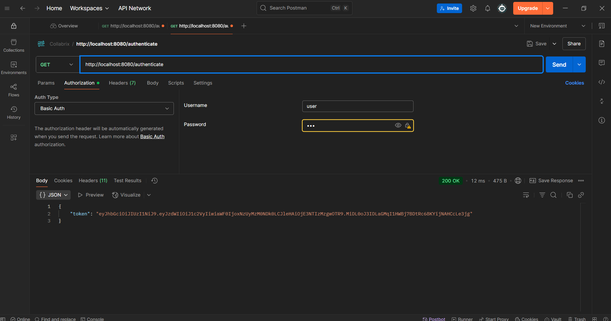
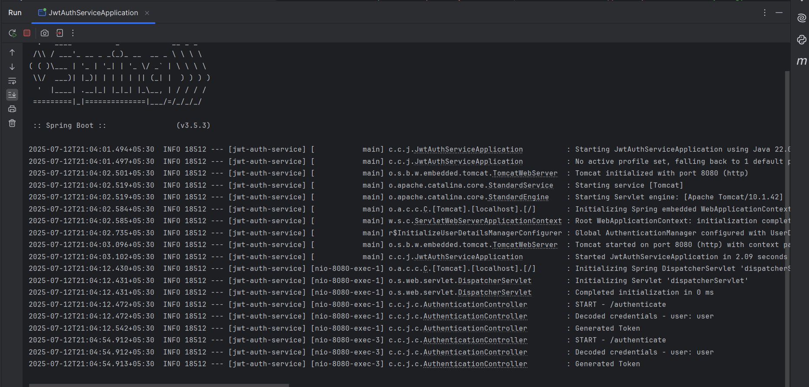

# Exercise 6 – JWT Authentication Service

This exercise demonstrates how to implement a simple authentication service using Spring Security and JWT.

## Summary

- Implemented `/authenticate` endpoint secured with Basic Auth.
- Validated hardcoded credentials (`user` / `pwd`).
- Generated JWT token using `jjwt` library.
- Returned the token as JSON in the response.

## Files

- 🔗 [AuthenticationController.java](./jwt-auth-service/src/main/java/com/congnizant_dn/jwt_auth_service/controller/AuthenticationController.java)
- 🔗 [SecurityConfig.java](./jwt-auth-service/src/main/java/com/congnizant_dn/jwt_auth_service/config/SecurityConfig.java)
- 🔗 [pom.xml](./jwt-auth-service/pom.xml)
- 🖼️ [Postman_Response_Output.png](./Postman_Response_Output.png)
- 🖼️ [Console_Output.png](./Console_Output.png)

## Output
### ▶️ Token Response in Postman

### ▶️ Logs from IntelliJ Console

