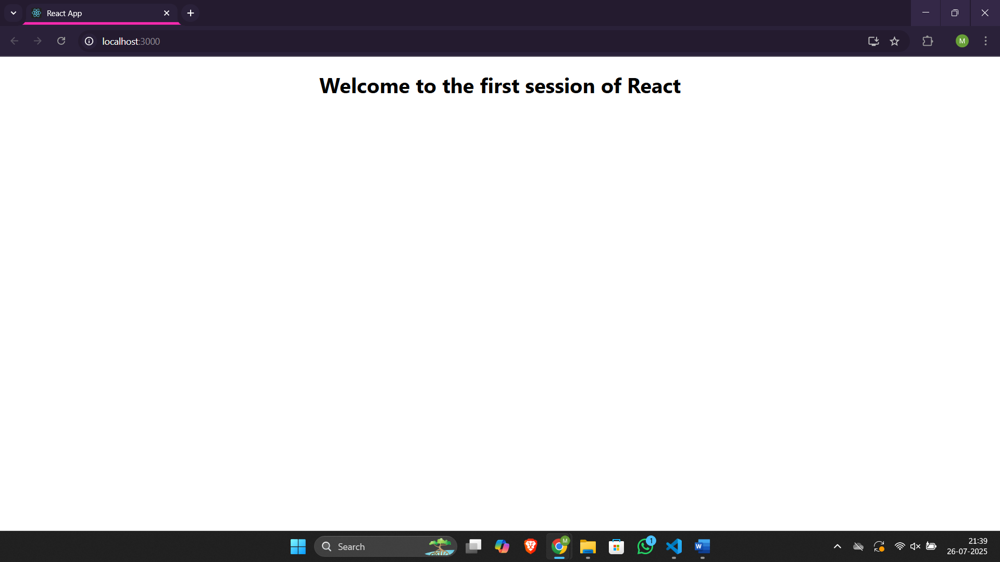

# Assignment 1 – ReactJS Hands-On Lab

## Files

- 🔗 [App.js](./myfirstreact/src/App.js)
- 🔗 [index.js](./myfirstreact/src/index.js)
- 🖼️ [Output Screenshot](./output.png)

## Output
### ▶️ Browser Output
- 
