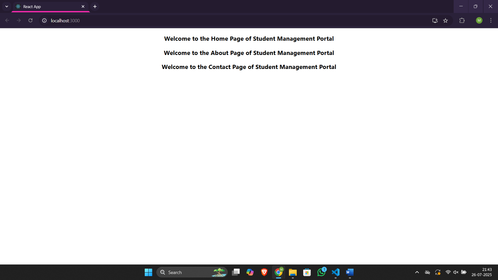

# Assignment 2 – ReactJS Hands-On Lab

## Files

- 🔗 [App.js](./studentapp/src/App.js)
- 🔗 [Home.js](./studentapp/src/Components/Home.js)
- 🔗 [About.js](./studentapp/src/Components/About.js)
- 🔗 [Contact.js](./studentapp/src/Components/Contact.js)
- 🖼️ [Output Screenshot](./output.png)

## Output
### ▶️ Browser Output
- 
