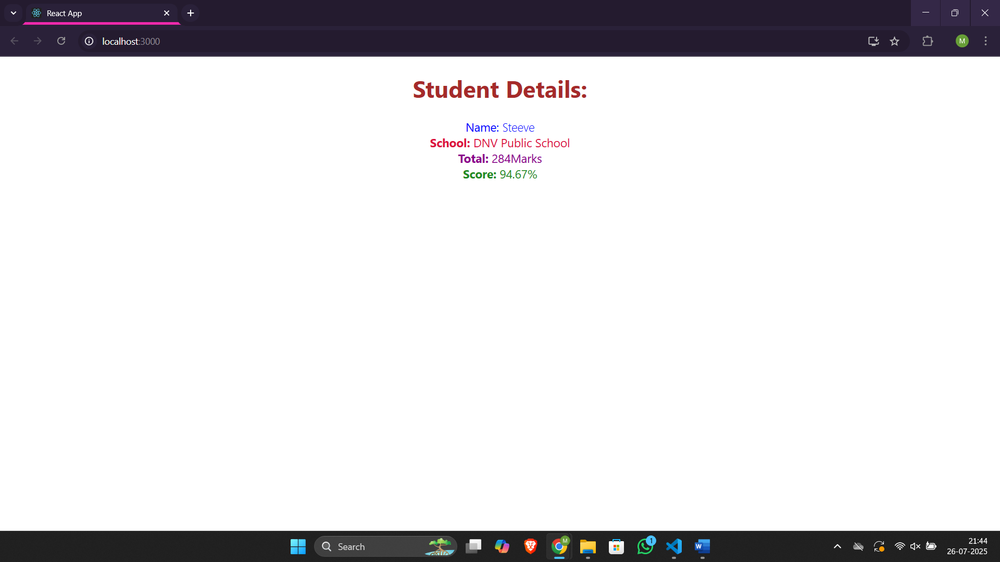

# Assignment 3 – ReactJS Hands-On Lab

## Files

- 🔗 [App.js](./scorecalculatorapp/src/App.js)
- 🔗 [CalculateScore.js](./scorecalculatorapp/src/Components/CalculateScore.js)
- 🔗 [mystyle.css](./scorecalculatorapp/src/Stylesheets/mystyle.css)
- 🖼️ [Output Screenshot](./output.png)

## Output
### ▶️ Browser Output
- 
