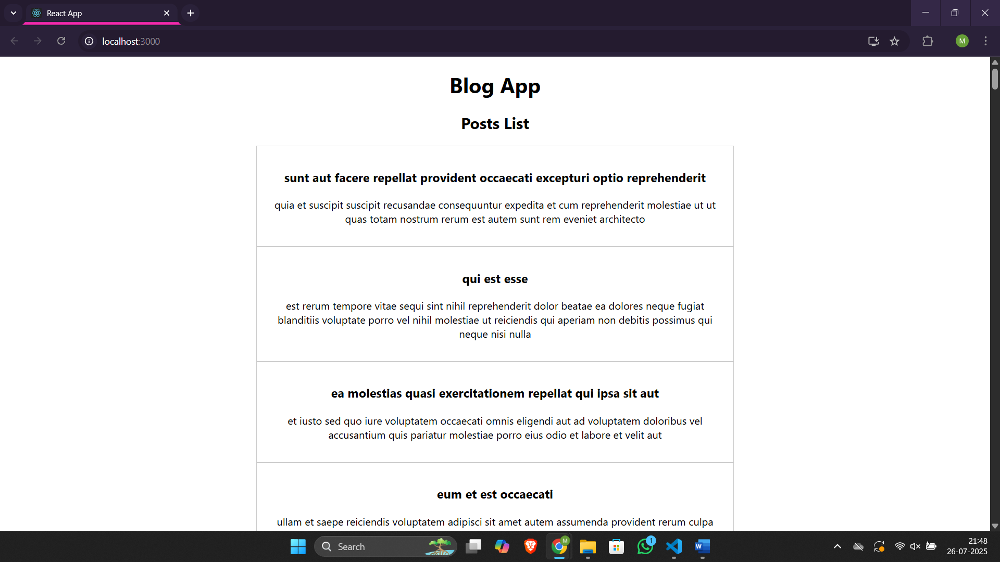

# Assignment 4 – ReactJS Hands-On Lab

## Files

- 🔗 [App.js](./blogapp/src/App.js)
- 🔗 [Post.js](./blogapp/src/Post.js)
- 🔗 [Posts.js](./blogapp/src/Posts.js)
- 🖼️ [Output Screenshot](./output.png)

## Output
### ▶️ Browser Output
- 
