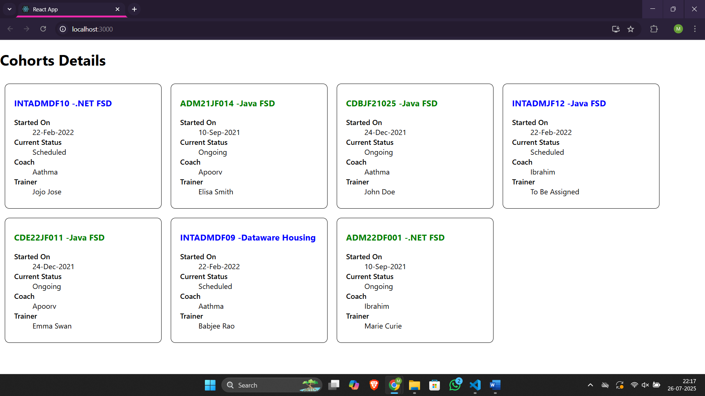

# Assignment 5 – ReactJS Hands-On Lab

## Files

- 🔗 [CohortDetails.js](./cohorttracker/src/CohortDetails.js)
- 🔗 [CohortDetails.module.css](./cohorttracker/src/CohortDetails.module.css)
- 🔗 [App.js](./cohorttracker/src/App.js)
- 🖼️ [Output Screenshot](./output.png)

## Output
### ▶️ Browser Output
- 
